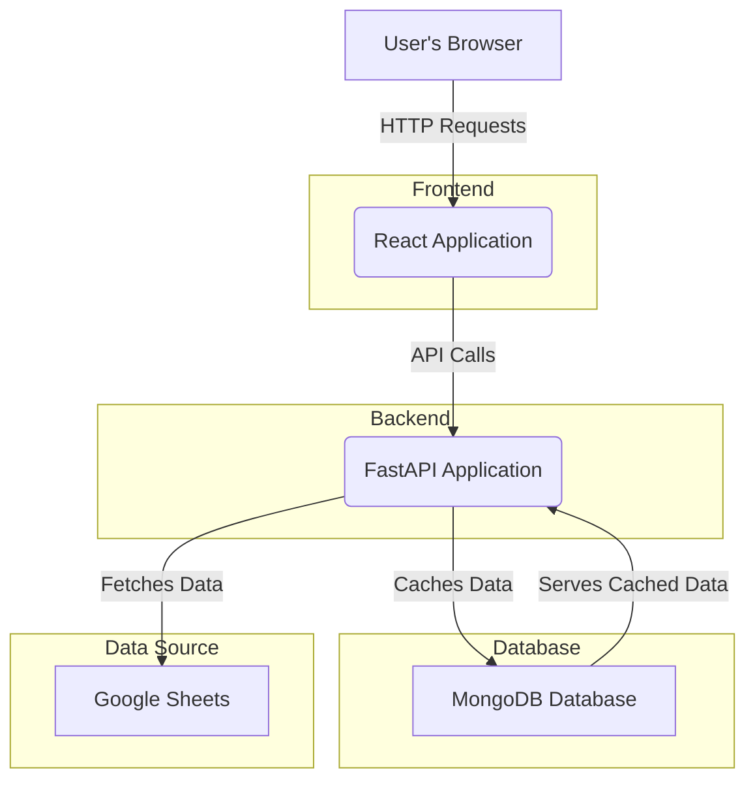

# Application Architecture Overview

This application follows a modern client-server architecture, separating the user interface (frontend) from the data processing and business logic (backend).

### Components

1.  **Frontend (React):**
    *   This is what you see and interact with in your browser. It's a Single-Page Application (SPA) built with React.
    *   Its main job is to provide a user-friendly interface for searching locomotive data.
    *   When you search, it makes API calls to the backend to get the information it needs to display.
    *   In the production environment, this is hosted on **Vercel**.

2.  **Backend (FastAPI):**
    *   This is the "engine" of the application. It's a Python-based API built with the FastAPI framework.
    *   It is responsible for all the heavy lifting:
        *   On startup, it fetches the raw data from the specified **Google Sheets**.
        *   It processes and cleans this data.
        *   It stores the processed data in a **MongoDB** database to act as a fast-access cache.
        *   It exposes API endpoints (like `/api/loco/...`) that the frontend can call to get data.
    *   In the production environment, this is hosted on **Render**.

3.  **Database (MongoDB):**
    *   The application uses a MongoDB database not as the primary source of truth, but as a **cache**.
    *   Storing the data from Google Sheets in a proper database makes retrieving it for user searches much faster and more efficient than reading the spreadsheet every time.
    *   The backend server automatically refreshes this data from the Google Sheet periodically to ensure it's up-to-date.

---

# Local Deployment Plan

Here is the step-by-step plan to get the application running on your local machine.

### Prerequisites

1.  **Python:** Ensure Python is installed and the `python` command is available in your terminal's PATH.
2.  **Node.js:** Ensure Node.js and `npm` (or `yarn`) are installed.
3.  **MongoDB:** Ensure you have a MongoDB server instance running on its default port (`mongodb://localhost:27017`).

### Step-by-Step Procedure

#### 1. Backend Setup

*   **Create Virtual Environment:** From the project root directory, create a Python virtual environment.
    *   `python -m venv venv`
*   **Activate Environment:**
    *   On Windows: `.\venv\Scripts\activate`
*   **Install Dependencies:** Install all required Python packages.
    *   `pip install -r backend/requirements.txt`
*   **Run Backend Server:** Start the FastAPI server. It will automatically connect to your local MongoDB and populate it with data from the Google Sheet.
    *   `uvicorn backend.server:app --reload`
    *   The server should now be running at `http://127.0.0.1:8000`.

#### 2. Frontend Setup

*   **Open a new terminal** for this part, keeping the backend server running in the first one.
*   **Navigate to Frontend Directory:**
    *   `cd frontend`
*   **Configure Backend URL:** The frontend needs to know where to send its API requests. Modify the `.env` file to point to your local backend server.
    *   **File:** `frontend/.env`
    *   **Change:** `REACT_APP_BACKEND_URL=https://dls-kzj.onrender.com`
    *   **To:** `REACT_APP_BACKEND_URL=http://127.0.0.1:8000`
*   **Install Dependencies:** Install all required JavaScript packages.
    *   `npm install` (or `yarn install` if you prefer yarn)
*   **Run Frontend Server:** Start the React development server.
    *   `npm start`
    *   Your browser should automatically open to `http://localhost:3000`.

### 3. Verification

*   Once both servers are running, you should be able to use the web application in your browser.
*   Try searching for a loco number to confirm that the frontend is successfully communicating with the backend and retrieving data.